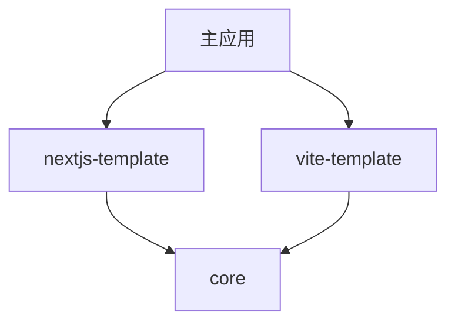

# 架构设计

本文档详细介绍了 Startup Template 项目的架构设计和技术选型。

## 🏗️ 整体架构

### Monorepo 架构

项目采用 Monorepo 架构，使用 Yarn Workspaces 管理多个相关包：

```
nextjs-startup-template/
├── packages/
│   ├── core/                 # 核心组件库
│   ├── nextjs-template/      # Next.js 应用
│   └── vite-template/        # Vite.js 模板
├── src/                      # 主应用源码
├── .husky/                   # Git hooks
└── 配置文件
```

### 包依赖关系



## 📦 包设计

### @relia-fe/core

**职责**: 提供跨框架的核心组件和工具

**技术栈**:
- React 18
- Material-UI v6
- TypeScript
- tsup (构建工具)

**目录结构**:
```
packages/core/
├── src/
│   ├── components/           # React 组件
│   │   ├── Button/
│   │   ├── Card/
│   │   └── index.ts
│   ├── theme/               # 主题系统
│   │   ├── createTheme.ts
│   │   ├── palette.ts
│   │   └── typography.ts
│   ├── providers/           # Context Providers
│   │   └── ThemeProvider.tsx
│   ├── utils/               # 工具函数
│   └── index.ts             # 主入口
├── dist/                    # 构建输出
└── package.json
```

**导出策略**:
- ESM 和 CJS 双格式支持
- 类型定义文件 (.d.ts)
- Tree-shaking 友好

### @relia-fe/nextjs-template

**职责**: Next.js 应用模板和页面组件

**技术栈**:
- Next.js 15 (App Router)
- React 18
- TypeScript
- Tailwind CSS

**目录结构**:
```
packages/nextjs-template/
├── src/
│   ├── app/                 # App Router
│   │   ├── layout.tsx
│   │   ├── page.tsx
│   │   └── globals.css
│   ├── components/          # 页面组件
│   │   ├── Header/
│   │   ├── Footer/
│   │   └── Layout/
│   └── lib/                 # 工具库
├── public/                  # 静态资源
└── package.json
```

### @startup/vite-template

**职责**: Vite.js React 应用模板

**技术栈**:
- React 18
- TypeScript
- Vite.js
- Material-UI

**结构**:
```
packages/vite-template/
├── src/
│   ├── components/          # React 组件
│   ├── pages/               # 页面组件
│   ├── hooks/               # 自定义 Hooks
│   ├── utils/               # 工具函数
│   ├── styles/              # 样式文件
│   ├── types/               # 类型定义
│   └── main.tsx             # 应用入口
├── public/                  # 静态资源
├── package.json
└── vite.config.ts
```

## 🎨 主题系统

### 设计原则

1. **一致性**: 跨框架的统一视觉体验
2. **可定制**: 支持主题定制和扩展
3. **响应式**: 适配不同屏幕尺寸
4. **可访问性**: 符合 WCAG 标准

### 主题结构

```typescript
interface Theme {
  palette: {
    primary: PaletteColor;
    secondary: PaletteColor;
    error: PaletteColor;
    warning: PaletteColor;
    info: PaletteColor;
    success: PaletteColor;
    background: {
      default: string;
      paper: string;
    };
    text: {
      primary: string;
      secondary: string;
    };
  };
  typography: {
    fontFamily: string;
    fontSize: number;
    h1: TypographyStyle;
    h2: TypographyStyle;
    // ...
  };
  spacing: (factor: number) => string;
  breakpoints: {
    xs: number;
    sm: number;
    md: number;
    lg: number;
    xl: number;
  };
}
```

### 跨框架主题共享

```typescript
// core/src/theme/createTheme.ts
export const createTheme = (options?: ThemeOptions) => {
  return {
    // Material-UI 主题配置
  };
};

// vite-template/src/hooks/useTheme.ts
import { useContext } from 'react';
import { ThemeContext } from '@relia-fe/core';

export function useTheme() {
  return useContext(ThemeContext);
}
```

## 🔧 构建系统

### 构建工具选择

**tsup**: 
- 快速的 TypeScript 构建工具
- 支持多种输出格式 (ESM, CJS, IIFE)
- 内置代码分割和 Tree-shaking
- 零配置 TypeScript 支持

### 构建配置

```typescript
// packages/core/tsup.config.ts
export default defineConfig({
  entry: ['src/index.ts'],
  format: ['esm', 'cjs'],
  dts: true,
  splitting: true,
  sourcemap: true,
  clean: true,
  external: ['react', 'react-dom', '@mui/material'],
});
```

### 构建流程

1. **类型检查**: TypeScript 编译器检查
2. **代码构建**: tsup 构建 ESM/CJS 格式
3. **类型生成**: 生成 .d.ts 文件
4. **代码分割**: 自动分割代码块

## 🚀 开发工具链

### 代码质量

**ESLint**:
- 基于 @typescript-eslint 规则
- React 特定规则
- 自定义规则配置

**Prettier**:
- 统一代码格式
- 与 ESLint 集成
- 支持多种文件类型

### Git Hooks

**Husky + lint-staged**:
- pre-commit: 代码检查和格式化
- commit-msg: 提交信息验证

```bash
# .husky/pre-commit
#!/usr/bin/env sh
. "$(dirname -- "$0")/_/husky.sh"

yarn lint-staged
yarn type-check
```

### 开发服务器

**Next.js Dev Server**:
- 热重载 (HMR)
- 快速刷新 (Fast Refresh)
- 自动路由
- 内置优化

## 📊 性能优化

### 包大小优化

1. **Tree-shaking**: 移除未使用的代码
2. **代码分割**: 按需加载组件
3. **外部依赖**: 避免重复打包
4. **压缩**: 生产环境代码压缩

### 运行时优化

1. **React.memo**: 组件记忆化
2. **useMemo/useCallback**: 计算结果缓存
3. **懒加载**: 动态导入组件
4. **图片优化**: Next.js Image 组件

### 构建优化

1. **并行构建**: Yarn Workspaces 并行执行
2. **增量构建**: 只构建变更的包
3. **缓存**: 构建结果缓存
4. **压缩**: Gzip/Brotli 压缩

## 🔒 类型安全

### TypeScript 配置

```json
{
  "compilerOptions": {
    "strict": true,
    "noUncheckedIndexedAccess": true,
    "exactOptionalPropertyTypes": true,
    "noImplicitReturns": true,
    "noFallthroughCasesInSwitch": true
  }
}
```

### 类型共享

```typescript
// core/src/types/index.ts
export interface ComponentProps {
  variant?: 'primary' | 'secondary';
  size?: 'small' | 'medium' | 'large';
  disabled?: boolean;
}

// vite-template/src/types/index.ts
export type { ComponentProps } from '@relia-fe/core';
```

## 🧪 测试策略

### 测试类型

1. **单元测试**: 组件和函数测试
2. **集成测试**: 组件交互测试
3. **端到端测试**: 完整用户流程测试

### 测试工具

- **Jest**: 测试运行器
- **React Testing Library**: React 组件测试
- **React Testing Library**: React 组件测试
- **Playwright**: E2E 测试

## 📈 扩展性设计

### 插件系统

```typescript
interface Plugin {
  name: string;
  install: (app: App) => void;
}

export const createApp = (plugins: Plugin[] = []) => {
  const app = createBaseApp();
  plugins.forEach(plugin => plugin.install(app));
  return app;
};
```

### 主题扩展

```typescript
export const extendTheme = (baseTheme: Theme, extensions: ThemeExtensions) => {
  return deepMerge(baseTheme, extensions);
};
```

### 组件扩展

```typescript
export const withVariants = <T extends ComponentProps>(
  Component: React.ComponentType<T>,
  variants: Record<string, Partial<T>>
) => {
  return (props: T & { variant?: keyof typeof variants }) => {
    const variantProps = variants[props.variant || 'default'] || {};
    return <Component {...variantProps} {...props} />;
  };
};
```

## 🔄 版本管理

### 语义化版本

- **MAJOR**: 破坏性变更
- **MINOR**: 新功能添加
- **PATCH**: Bug 修复

### 发布流程

1. 代码审查和测试
2. 版本号更新
3. 生成 CHANGELOG
4. 创建 Git 标签
5. 发布到 npm

## 📚 文档系统

### 文档类型

1. **API 文档**: 自动生成的 API 参考
2. **使用指南**: 详细的使用说明
3. **示例代码**: 实际使用案例
4. **架构文档**: 系统设计说明

### 文档工具

- **TypeDoc**: API 文档生成
- **Storybook**: 组件文档和测试
- **Markdown**: 文档编写

这个架构设计确保了项目的可维护性、可扩展性和开发效率，为团队协作和长期发展奠定了坚实的基础。